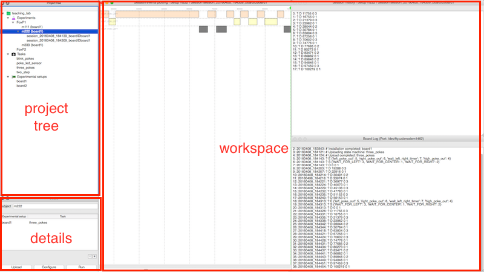
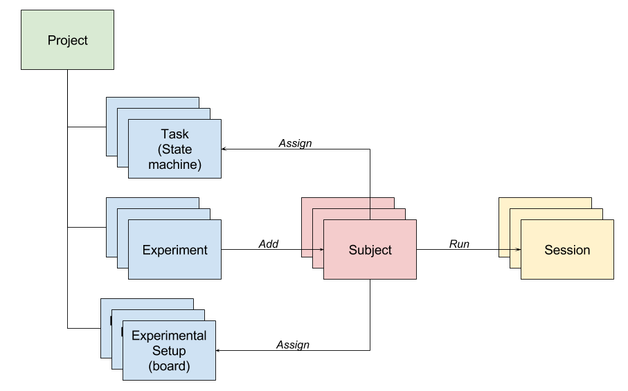
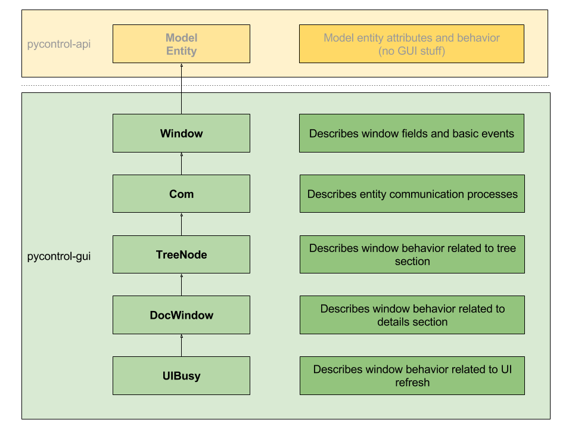

User Interface
=================================================

Interface organization
----------------------

The GUI is roughly divided in 3 main sections:

* **Project tree**: tree view like to organize project contents
* **Details view**: get detailed info about each component
* **Workspace**: open plugins and consoles to manage and monitorize experiment running

Model entities
--------------

pybpodgui_plugin is designed around the following entities relationships:

* **Project**: top level element that aggregates a set of **Experiments**, **Tasks** and **Boards**
* **Experiment**: aggregates a set of **Subjects** with certain settings
* **Task**: programmed state machine based a set of **States**, **Events** and **Variables**
* **Board**: hardware configuration of a board, its serial port and a specific **Framework**
* **Subject**: represents the living subject that is being studied, but it is also a confluence of relationships between an **Experiment**, a **Task** and a **Board**
* **Session**: report generated every time a subject configuration is run on a board

Model components
----------------

Model file structure
--------------------
::

    | pybpodgui_plugin
       | board
          |  __init__.py        # Board = type('Board',tuple(conf.GENERIC_EDITOR_PACKAGES_FINDER.find_class('models.board.Board') + [BoardUIBusy]),{})
          |  board_com.py
          |  board_dockwindow.py
          |  board_treenode.py
          |  board_uibusy.py
          |  board_window.py
       | experiment
          |  __init__.py                # Experiment = type('Experiment',tuple(conf.GENERIC_EDITOR_PACKAGES_FINDER.find_class('models.experiment.Experiment') + [ExperimentUIBusy]),{})
          |  experiment_dockwindow.py       # ExperimentDockWindow --> ExperimentTreeNode
          |  experiment_treenode.py         # ExperimentTreeNode --> ExperimentWindow
          |  experiment_uibusy.py           # ExperimentUIBusy --> ExperimentDockWindow
          |  experiment_window.py           # ExperimentWindow --> pycontrolapi.models.experiment.Experiment
       | project
          |  __init__.py        # Project = type('Project',tuple(conf.GENERIC_EDITOR_PACKAGES_FINDER.find_class('models.project.Project') + [ProjectUIBusy]),{})
          |  project_dockwindow.py
          |  project_treenode.py
          |  project_uibusy.py
          |  project_window.py
       | projects
          |  __init__.py                # Projects = type('Projects',tuple(conf.GENERIC_EDITOR_PACKAGES_FINDER.find_class('models.projects.Projects') + [ProjectsSignals]),{})
          |  projects_dockwindow.py
          |  projects_signals.py
          |  projects_treenode.py
          |  projects_window.py
       | session
          |  __init__.py                # Session = type('Session',tuple(conf.GENERIC_EDITOR_PACKAGES_FINDER.find_class('models.session.Session') + [SessionUIBusy]),{})
          |  session_dockwindow.py          # SessionDockWindow --> SessionTreeNode
          |  session_signals.py             # SessionSignals --> SessionDockWindow
          |  session_treenode.py            # SessionTreeNode --> SessionWindow
          |  session_uibusy.py              # SessionUIBusy --> SessionSignals
          |  session_window.py              # SessionWindow --> pycontrolapi.models.session.Session
       | setup
          |  board_task
             |  __init__.py             # BoardTask = type('BoardTask',tuple(conf.GENERIC_EDITOR_PACKAGES_FINDER.find_class('models.board_task.BoardTask') + [BoardTaskUIBusy]),{})
             |  board_task_uibusy.py        # BoardTaskUIBusy --> BoardTaskWindow
             |  board_task_window.py        # BoardTaskUIBusy --> BoardTaskWindow
          |  __init__.py                # Setup = type('Setup',tuple(conf.GENERIC_EDITOR_PACKAGES_FINDER.find_class('models.setup.Setup') + [SetupUIBusy]),{})
          |  setup_com.py                   # ComSetup --> SetupDockWindow
          |  setup_dockwindow.py            # SetupDockWindow --> SetupTreeNode
          |  setup_treenode.py              # SetupTreeNode --> SetupWindow
          |  setup_uibusy.py                # SetupUIBusy --> ComSetup
          |  setup_window.py                # SetupWindow --> pycontrolapi.models.setup.Setup
       | task
          |  __init__.py                # Task = type('Task',tuple(conf.GENERIC_EDITOR_PACKAGES_FINDER.find_class('models.task.Task') + [TaskDockWindow]),{})
          |  task_dockwindow.py             # TaskDockWindow --> TaskTreeNode
          |  task_treenode.py               # TaskTreeNode --> TaskWindow
          |  task_window.py                 # TaskWindow --> pycontrolapi.models.task.Task

